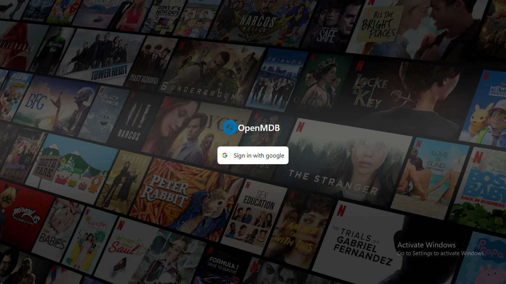
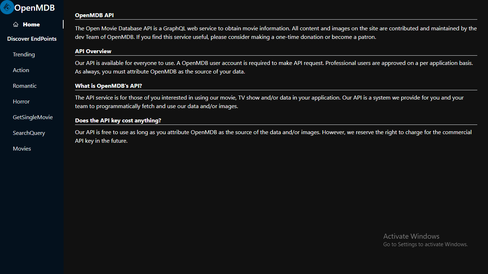

 # OpenMDB

## What is OpenMDB's API?

The API service is for those of you interested in using our movie, TV show and/or data in your application. Our API is a system we provide for you and your team to programmatically fetch and use our data and/or images.

screenShots

